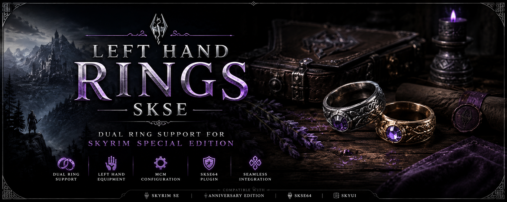

# left-hand-rings-skse
Modern SKSE plugin for Skyrim Special Edition adding immersive dual-ring support, left-hand equipment slots, MCM customization, and seamless gameplay integration.

# Left Hand Rings SKSE

### Modern dual-ring support for Skyrim Special Edition

  

 

Skyrim SE • Anniversary Edition • SKSE64 • SkyUI

---

# Overview

Left Hand Rings SKSE is a modern Skyrim Special Edition SKSE plugin that enables immersive dual-ring equipment support with configurable left-hand slots, enhanced compatibility, and lightweight gameplay integration.

Designed for modern Skyrim SE/AE modlists while maintaining excellent performance and stability.

---

# Features

✨ Dual ring support  
✨ Left-hand equipment slot system  
✨ SKSE64 integration  
✨ Full SkyUI MCM support  
✨ Lightweight runtime plugin  
✨ Configurable equipment slots  
✨ Modern Skyrim AE compatibility  
✨ Minimal performance impact  

---

# Requirements

- Skyrim Special Edition
- Anniversary Edition
- SKSE64
- SkyUI

---

# Installation

1. Download the latest release
2. Install using Mod Organizer 2 or Vortex
3. Launch Skyrim using SKSE64

---

# Compatibility

Compatible with modern Skyrim SE and Anniversary Edition modlists.

---

# SEO Keywords

Skyrim left hand rings, Skyrim dual rings, SKSE plugin, Skyrim SE ring mod, left hand equipment Skyrim, Skyrim Special Edition mods, dual ring support Skyrim, immersive Skyrim mods, Skyrim gameplay enhancement.

---

# License

MIT License

---

# Popular Searches

Skyrim dual ring mod  
Skyrim left hand ring support  
SKSE left hand rings  
Skyrim Special Edition ring mod  
Skyrim AE dual rings  
Immersive Skyrim jewelry mod  
Dual ring equipment Skyrim  
Skyrim SE gameplay enhancement  
Modern Skyrim SKSE plugin  
Best Skyrim ring mods  

---

# Community Support

Left Hand Rings SKSE is designed for modern Skyrim SE and Anniversary Edition modlists focused on immersion, roleplay, equipment expansion, and gameplay customization.

The project supports lightweight integration with modern SKSE-based setups while maintaining high compatibility and stable performance.
